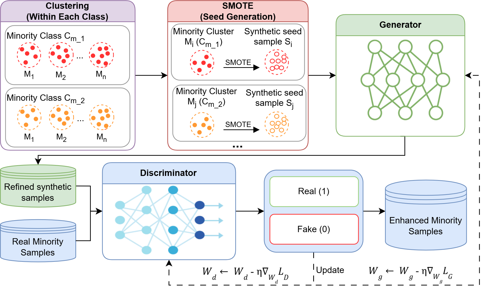

# KSGAN: K-Means SMOTE and GAN for Data Augmentation of Minority Classes in Imbalanced Multiclass Prediction of MOOC Learning Outcomes

## Overview

This repository contains the source code and notebooks for the paper:

> **KSGAN: K-Means SMOTE and GAN for Data Augmentation of Minority Classes in Imbalanced Multiclass Prediction of MOOC Learning Outcomes**

The study addresses severe class imbalance in multiclass prediction of MOOC learning outcomes from sequential learning behavioral data.

**KSGAN** combines **K-Means SMOTE** and **GAN-based data refinement** in two stages. The first stage generates synthetic seed samples within local minority clusters. The second stage refines these seed samples toward the distribution of real minority samples.

The original **MOOCCubeX** dataset can be accessed at:

https://github.com/THU-KEG/MOOCCubeX

---

## Repository Structure

The repository is organized into several folders for data processing, augmentation, and classification.

```text
.
│   Readme.md
│
└───src
    ├───Baseline_model
    │   ├───BiLSTM
    │   ├───GRU
    │   ├───LSTM
    │   ├───RNN
    │   └───V0_mask_DL
    │
    ├───Data_processed
    │
    └───Process
        ├───Augmentation
        ├───Data_labeling
        ├───Data_processing
        ├───Imputation
        ├───Split_data
        └───Time_Series
```

### `src/Baseline_model`

Contains notebooks for the hybrid deep learning models used for multiclass learning-outcome prediction.

* `RNN/`: RNN-based hybrid model.
* `GRU/`: GRU-based hybrid model.
* `LSTM/`: LSTM-based hybrid model.
* `BiLSTM/`: BiLSTM-based hybrid model.
* `V0_mask_DL/`: Earlier models using the missing-value mask representation.

### `src/Data_processed`

Contains processed datasets used in the experiments.

### `src/Process`

Contains the main data preparation and augmentation procedures.

* `Augmentation/`: Implementations of SMOTE, K-Means SMOTE, GAN, SMOTified-GAN, and KSGAN.
* `Data_labeling/`: Procedures for generating and assigning learning-outcome labels.
* `Data_processing/`: Preprocessing of MOOC user, course, video, exercise, comment, and reply data.
* `Imputation/`: Missing-value imputation procedures.
* `Split_data/`: Dataset splitting procedures.
* `Time_Series/`: Construction and processing of temporal behavioral features.

---

## KSGAN Framework

The overall workflow of KSGAN is shown below.

<p align="center">
  
</p>

KSGAN consists of two main stages:

### Stage 1: Minority-Focused K-Means SMOTE Augmentation

For each minority class \(M_c\), K-Means is first applied to the minority-class samples:

$$
M_c \rightarrow
\{M_{c,1},M_{c,2},\ldots,M_{c,K}\}.
$$

Unlike the original K-Means SMOTE, KSGAN performs clustering only on minority-class samples. SMOTE is then applied separately within each minority cluster to generate synthetic seed samples.

### Stage 2: GAN-based Data Refinement

The seed samples generated by SMOTE are subsequently refined using a GAN.

Unlike a standard GAN, KSGAN does not use random noise as the Generator input. Instead, each seed sample \(s\) is directly provided to the Generator:

$$
\tilde{x}=G(s).
$$

The Generator acts as a data refiner, learning to adjust the seed samples toward the distribution of real minority samples.
